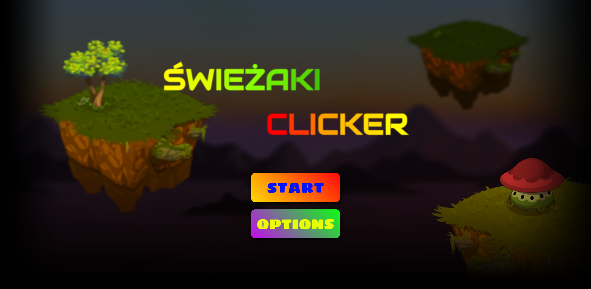
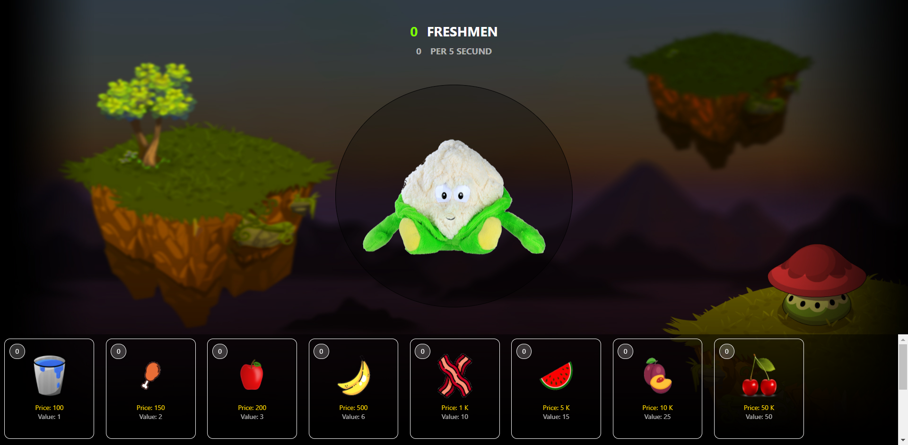

# Freshmen - Clicker Games
- Simple browser clicker game written in JavaScript using SQL.
- Live demo [_here_](https://pioxtex.github.io/Freshmen_Clicker/).


## Table of Contents
* [General Info](#general-information)
* [Technologies Used](#technologies-used)
* [Features](#features)
* [Screenshots](#screenshots)
* [Setup](#setup)
* [Project Status](#project-status)
* [Room for Improvement](#room-for-improvement)
* [Acknowledgements](#acknowledgements)
* [Contact](#contact)
<!-- * [License](#license) -->


## General Information
- Popular, simple, fun clicker game to pass the time.
- The goal of the game is to score as many points as possible and buy the last item from the store.
- The aim of the project was to learn and improve JavaScript and PHP.


## Technologies Used
- Jquery - version 3.5.1
- PHP - version 8.0.7
- SQL - version 10.4.19-MariaDB
- HTML - version 5


## Features
List the ready features here:
- debug mode - Variable for displaying errors and information
```js
const debug = true
```


## Screenshots




## Setup
- Browser / local server supporting [requirements](#technologies-used)


## Project Status
> Project is: _in progress_


## Room for Improvement
- animations
- scoring points
- saving data to the database


## To do:
- Options window
- Animations


## Acknowledgements
- This project was inspired by various mini-games on the phone
- Thanks a lot


## Contact
Created by [@Pioxtex](#)


<!-- Optional -->
<!-- ## License -->
<!-- This project is open source and available under the [... License](). -->

<!-- You don't have to include all sections - just the one's relevant to your project -->
